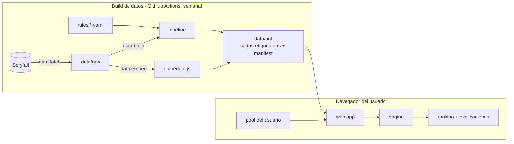
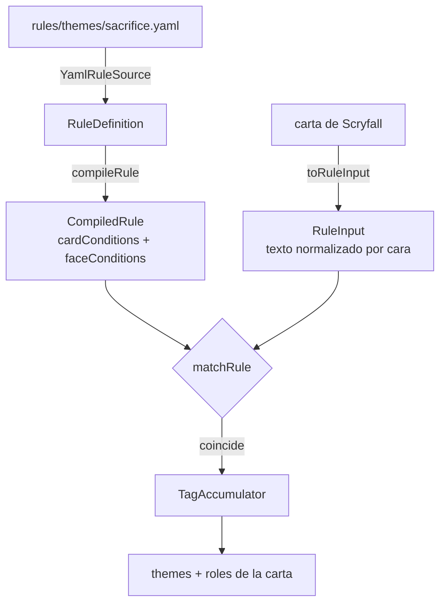
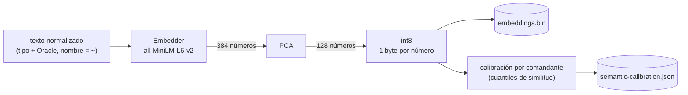

# Arquitectura de ReCom TCG

Esta guía explica cómo funciona el proyecto por dentro y por qué está organizado así. Complementa a la [especificación](especificacion.md), que dice **qué** hace la herramienta; aquí se explica **cómo** está construida.

## 1. La idea en una imagen

El trabajo se divide en dos momentos: lo que se calcula una vez por semana en GitHub Actions (el *build* de datos) y lo que se calcula en el navegador de cada usuario.



¿Por qué así? Las etiquetas de una carta (Blood Artist es `sacrifice/asks`) no dependen del pool de nadie, así que se calculan una sola vez en el build. Al navegador le queda solo lo que sí depende del pool: filtrar, puntuar y explicar. Por eso el pool nunca sale del equipo del usuario (RN-20).

## 2. Mapa del repositorio

| Carpeta | Responsabilidad | ¿Toca red o archivos? |
|---|---|---|
| `packages/engine` | Tipos del dominio y lógica pura: identidades de color, normalización de texto. En M2: puntuación y evidencia. | No. Funciona igual en el navegador y en Node. |
| `packages/pipeline` | Build de datos: descarga Scryfall, aplica las reglas YAML y escribe los artefactos. | Sí, pero solo en `scryfall/`, `storage/` y `cli/`. |
| `packages/rules-schema` | Esquemas JSON de cada YAML, el validador y el mapa de rutas del repo. | Lee archivos del repo. |
| `apps/web` | La interfaz en Next.js con exportación estática. | No, salvo descargar los artefactos de datos (M3). |
| `rules/`, `model.yaml`, `i18n/`, `import-profiles/` | Conocimiento editable por la comunidad, sin tocar código. | — |

Las dependencias van en una sola dirección: `web → engine`, `pipeline → engine + rules-schema`. El `engine` no depende de nadie. Así la lógica más importante (la que decide el ranking) es la más fácil de probar y de reutilizar en una API o un bot.

## 3. Recorrido de una regla, de YAML a etiqueta

Este es el camino más importante del pipeline. Vale la pena seguirlo con el código abierto.



1. **`rule-source.ts`**: `YamlRuleSource` lee los YAML y entrega definiciones.
2. **`compile.ts`**: cada clave de `match:` se convierte en una *condición* usando el registro de `conditions.ts`.
3. **`normalize.ts`**: la carta se convierte en `RuleInput`: texto en minúsculas, su nombre como `~`, sin texto recordatorio y separado por caras.
4. **`match.ts`**: una regla coincide si todas sus condiciones de carta se cumplen y todas sus condiciones de texto se cumplen **en una misma cara**.
5. **`tag-accumulator.ts`**: junta las etiquetas, quedándose con el peso máximo (nunca la suma).
6. **`apply.ts`**: `tagCard()` orquesta los pasos 4 y 5 para una carta.

Dos herramientas acompañan a quien escribe reglas, y ninguna toca el motor:

- **`pnpm fixtures:sync`** (`cli/sync-fixtures.ts` + `scryfall/fixture.ts`): junta los nombres de todos los `examples`, los busca en los datos descargados y reescribe `fixtures/cards.json` con solo los campos que leen las reglas. Así los tests usan el texto Oracle real y siguen corriendo sin red.
- **`pnpm rules:report [prefijo]`** (`cli/rules-report.ts` + `rules/coverage.ts`): aplica cada regla al pool de Commander completo y muestra cuántas cartas etiqueta, con muestras. `measureCoverage()` es una función pura (recibe cartas y reglas, devuelve números), por eso tiene su propio test y el CLI solo imprime.

Los ejemplos miden la *exhaustividad* de una regla (¿atrapa lo que esperaba?); el reporte mide su *precisión* (¿qué más atrapa?). Hacen falta las dos.

## 4. La señal semántica (embeddings)

Las reglas YAML son precisas pero solo detectan lo que alguien escribió. La señal semántica cubre el resto (RN-25): mide qué tan parecido es el texto de dos cartas, aunque usen palabras distintas.



1. **`embedding-text.ts`**: el texto que lee el modelo es el mismo texto normalizado de las reglas. Como el nombre de la carta ya es `~`, la similitud sale de lo que la carta hace, nunca de cómo se llama.
2. **`transformers-embedder.ts`**: un modelo abierto corre localmente con transformers.js. Se descarga una vez a `.cache/models`. Es el único archivo que conoce esa librería.
3. **`pca.ts`**: reduce 384 dimensiones a 128 conservando las direcciones donde las cartas más se diferencian. En pruebas con 30 mil vectores, la similitud cambió en promedio 0,0001.
4. **`vector.ts`** (engine): cuantiza a int8. El archivo pasa de ~45 MB a ~4 MB.
5. **`calibration.ts`** (engine): una similitud de 0,45 puede ser altísima para un comandante y mediocre para otro. Por eso, para cada comandante se guarda la distribución de su similitud contra las cartas que podría jugar, y en el navegador la similitud cruda se convierte en percentil (RN-26).

Solo se calculan vectores para el **pool de Commander** (cartas legales y prohibidas): unas 32 mil de las ~35 mil de `cards.json`. Las cartas de colecciones «Un», Alchemy o memorabilia siguen en `cards.json`, para que la importación pueda reconocerlas y reportarlas (RN-19), pero no compiten en el ranking y no necesitan vector.

`embeddings.bin` no repite los identificadores de las cartas: `embeddings.json` guarda, para cada fila, su posición en `cards.json` (`cardIndexes`). `openEmbeddingTable()` une ambos archivos y se niega a hacerlo si vienen de builds distintos, porque eso pegaría vectores a cartas equivocadas sin avisar. Por eso `data:embed` se ejecuta siempre después de `data:build`.

Las funciones de `vector.ts`, `calibration.ts` y `artifacts.ts` viven en el engine porque se usan en los dos lados: en el build para generar los datos y en el navegador para leerlos. Así ambos lados siempre calculan igual.

## 5. SOLID en este proyecto

| Principio | Qué dice | Dónde se aplica |
|---|---|---|
| **S** · Responsabilidad única | Un módulo tiene una sola razón para cambiar. | `ScryfallClient` solo sabe de la API; `RawDataStore` solo de nombres de archivo; `buildCardData` solo transforma datos; los CLI solo conectan piezas. |
| **O** · Abierto/cerrado | Se extiende agregando código, no modificando el existente. | Un operador nuevo de `match:` es una entrada nueva en `CARD_CONDITIONS` o `FACE_CONDITIONS`. Un chequeo nuevo del validador es un objeto nuevo en `SEMANTIC_CHECKS`. |
| **L** · Sustitución de Liskov | Cualquier implementación de una interfaz debe poder usarse en su lugar. | Cualquier `RuleSource` funciona con `loadRules()`: el de YAML o un objeto en un test. Cualquier `FetchFn` funciona con `ScryfallClient`. |
| **I** · Segregación de interfaces | Interfaces pequeñas, que pidan solo lo necesario. | `RuleSource` tiene dos métodos. `CardCondition` y `FaceCondition` están separadas porque se evalúan distinto. |
| **D** · Inversión de dependencias | Lo importante depende de abstracciones, no de detalles. | `loadRules()` depende de `RuleSource`, no del disco. `ScryfallClient` recibe `fetch` y `sleep`, así los tests usan un Scryfall falso. `buildEmbeddings()` recibe un `Embedder`: en producción un modelo real, en los tests uno falso que no descarga nada. |

SOLID nació en la orientación a objetos, pero en TypeScript muchas veces se aplica con funciones y objetos literales en lugar de jerarquías de clases. En este proyecto se usan clases solo cuando hay estado o dependencias que inyectar (`ScryfallClient`, `TagAccumulator`, los *stores*). Lo demás son funciones puras.

## 6. Convenciones de Clean Code

- **Nombres que dicen qué hacen:** `buildCardData`, `isDeckCard`, `matchRule`. Los booleanos empiezan con `is`, `has`, `can`.
- **Funciones puras siempre que se pueda:** misma entrada, misma salida, sin E/S. Son las más fáciles de probar y de entender. La E/S se concentra en los bordes (`cli/`, `storage/`, `scryfall/client.ts`).
- **Sin valores mágicos:** las rutas están en `REPO_LAYOUT`, los umbrales en `model.yaml` (RN-23), los textos de la interfaz en `content/` e `i18n/`.
- **Errores que explican cómo arreglarse:** «"Viscera Seer" is not in fixtures… add it with its exact Oracle text», o «Did you run pnpm data:fetch?».
- **Comentarios que explican el porqué**, no el qué. Cuando una decisión viene de la especificación, se cita su regla (`RN-xx`).
- **Un test por comportamiento**, con nombres que se leen como frases: «text conditions must hold on the same face».

## 7. La web app

Next.js con el App Router y **exportación estática**: `next build` genera HTML, CSS y JS planos en `apps/web/out/`, sin servidor.

| Archivo | Rol |
|---|---|
| `app/layout.tsx` | El marco común a todas las páginas: fuentes, estilos globales y pie de página. |
| `app/page.tsx` | La página de inicio. Solo compone componentes y les pasa datos. |
| `app/globals.css` | Tokens de diseño (colores, radios) y estilos base. |
| `components/<Nombre>/` | Un componente por carpeta, con su `.tsx` y su `.css`. Las clases siguen BEM: `bloque__elemento--modificador`. |
| `content/` | Los textos de la página, separados del marcado. |

Los componentes reciben por *props* lo que muestran: `StepList` dibuja los pasos que le pasen, no sabe cuáles existen. Así se reutilizan en las pantallas de M3.

En M3 el flujo será: la página descarga `data/out/cards.json` una vez por versión (y lo guarda en caché), el pool se importa en el navegador y el `engine` corre dentro de un Web Worker, para que la interfaz no se congele mientras calcula.

## 8. Cómo extender el proyecto

| Quiero… | Tengo que… |
|---|---|
| Detectar una mecánica nueva | Agregar una regla en `rules/themes/` o `rules/roles/` con sus `examples`, correr `pnpm fixtures:sync` para traer las cartas de ejemplo y revisar la precisión con `pnpm rules:report <prefijo>`. |
| Un operador nuevo en `match:` | Una entrada en `conditions.ts` y la propiedad en `rule-file.schema.json`. |
| Un chequeo nuevo del validador | Un objeto `SemanticCheck` en `semantic-checks.ts`, agregado a `SEMANTIC_CHECKS`, con su test. |
| Un tipo nuevo de archivo YAML | Su `.schema.json` y una ruta en `SCHEMA_ROUTES`. |
| Un componente web | Una carpeta en `components/` con su `.tsx` y su `.css`. |
| Probar otro modelo de embeddings | Cambiar `semantic.model` en `model.yaml` y correr `pnpm data:embed`. Si el modelo no es compatible con transformers.js, escribir otro `Embedder`. |

## 9. Cómo leer el historial

Cada commit hace **un solo cambio** y su mensaje explica el porqué. Para estudiar una refactorización, lo más claro es verla commit por commit:

```bash
git log --oneline
git show <hash>        # el cambio completo con su explicación
```

En VS Code, la vista **Source Control → Commits** (o la extensión GitLens) muestra lo mismo de forma visual.
